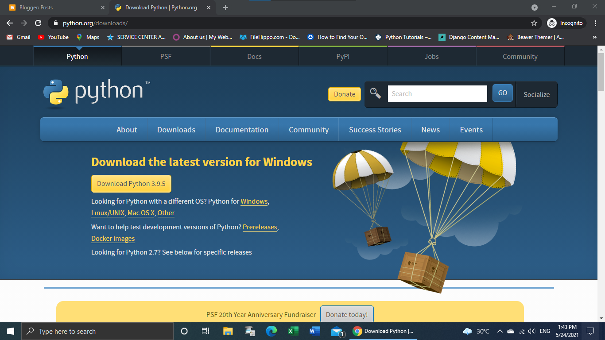
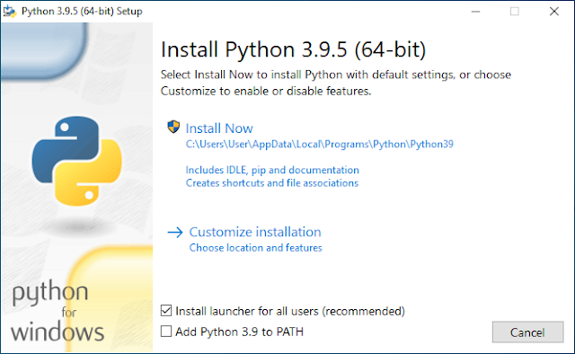
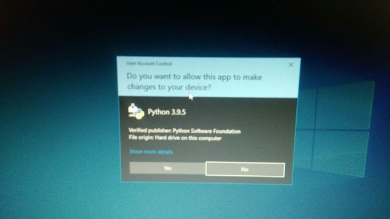
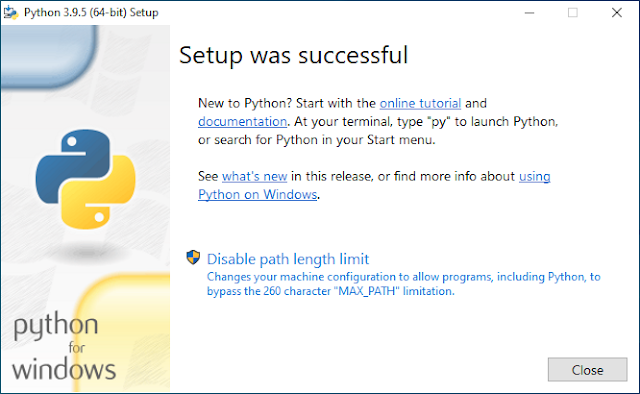
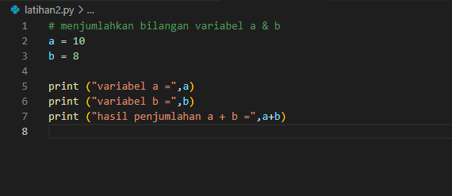
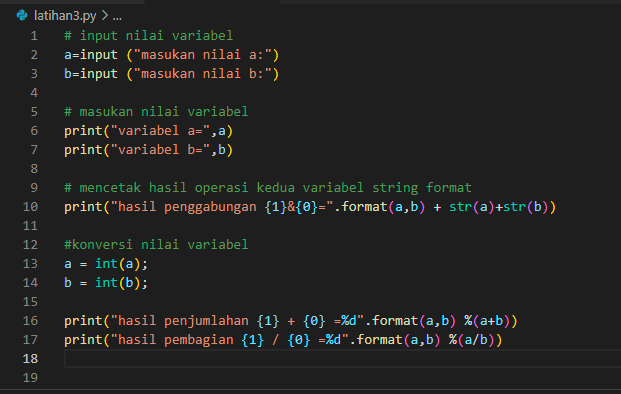

# belajar bahasa pemrograman python untuk pemula

daftar isi :

- [belajar bahasa pemrograman python untuk pemula](#belajar-bahasa-pemrograman-python-untuk-pemula)
- [apa itu phyton](#apa-itu-phyton)
- [Latihan 1](#latihan-1)
- [latihan 2](#latihan-2)
- [latihan 3](#latihan-3)
- [sekian dan terimakasih](#sekian-dan-terimakasih)
  
# apa itu phyton

aplikasi, perintah komputer, dan melakukan analisis data. Sebagai general-purpose language, Python bisa digunakan untuk membuat program apa saja dan menyelesaikan berbagai permasalahan. Selain itu, Python juga dinilai mudah untuk dipelajari. Namun, jangan salah, Python termasuk bahasa pemrograman tingkat tinggi. Mulai dari profesi back-end developer, IT, sampai data scientist, Python benar-benar menjadi pilihan favorit.

**berikut cara instalasinya**
1. Kunjungi halaman python berikut lalu klik download.
   
2. Klik "Install Now", adapun untuk opsi "Add Python 3.9 to PATH" bisa Anda centang atau tidak. Pada contoh saya kali ini saya centang tapi pas screenshot belum tercentang
   
3. Klik Yes
   
4. Proses install sudah selesai silahkan klik Close.
5. 

# Latihan 1

**buat file latihan1.py dan ketik kode seperti contoh dibawah ini**

**klik tombol run dan akan muncul hasilnya pada terminal**

# latihan 2

**buat file latihan2.py dan ketik kode seperti contoh dibawah ini**

**klik tombol run dan akan muncul hasilnya pada terminal**

# latihan 3

**buat file latihan3.py dan ketik kode seperti contoh dibawah ini**

**klik tombol run dan input variabel a dan b maka akan muncul hasilnya pada terminal**

# sekian dan terimakasih